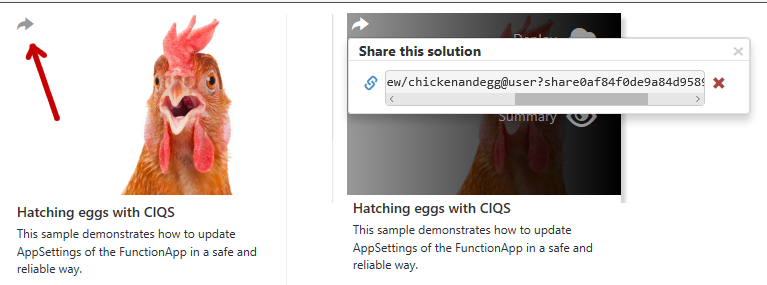

---
date: 2017-03-23 10:00 PST DST
layout: post
published: false
---
- Deployment integrity improvements
- Private solution sharing
- Support for high-throughput Machine Learning web service endpoints
- FunctionApp/AppService customization support
- Support for binaries and subdirectories in Azure Functions
- Significant performance improvements
- Bug fixes

<!--more-->

### Deployment integrity improvements

This change addresses several major flaws previously found in the CIQS platform. Namely:
- new versions of existing solutions made previous deployments dysfunctional;
- previous deployments of solutions no longer present in the gallery (or SAW) became unavailable in the deployments list

We have removed the dependency between deployments and Gallery metadata. As a consequence, CIQS will now retain integrity of all deployments.

This frees solution authors from the burden of worrying whether the changes they are making are backwards compatible; everything that has been deployed will keep working regardless of what new changes are being made to existing solutions, even if, for whatever reason, a solution gets removed from the Gallery or SAW.

### Private solution sharing

Unpublished solutions from SAW can now be privately shared with anyone.



### Support for high-throughput Machine Learning web service endpoints

Example:

```xml
<AzureMlWebService title="Deploying as a high-throughput Web Service" hiddenParameters ="true">
  <GalleryUrl>https://gallery.cortanaintelligence.com/Details/nyc-taxi-binary-classification-scoring-exp-2</GalleryUrl>
  <HighThroughputEndpoint endpointName=”highThroughputEndpoint”>
    <ThrottleLevel>High</ThrottleLevel>
    <MaxConcurrentCalls>100</MaxConcurrentCalls>
  </HighThroughputEndpoint>
</AzureMlWebService>
```
[Detailed documentation](../solution-authoring.html#azuremlwebservice)
<br />
[SAW Sample](https://github.com/Azure/Azure-CortanaIntelligence-SolutionAuthoringWorkspace/tree/master/Samples/012-mlwebsvc)

### FunctionApp/AppService customization support

Introducing **&lt;AzureFunctionApp&gt;**, a management provisioning step with the following capabilities:
- FunctionApp  customizations
  - always on (yes/no)
  - 32bit/64bit
  - enable/disable storage account creation
  - service plan sku and tier
- adding/removing AppSettings and ConnectionStrings at any time in a safe an reliable way
- deploying WebJobs into the FunctionApp at any time without ARM templates (this is compatible with all existing WebJobs!)

[SAW Sample](https://github.com/Azure/Azure-CortanaIntelligence-SolutionAuthoringWorkspace/tree/master/Samples/011-chickenandegg) (customizations and AppSettings)
<br />
*Detailed documentation and more samples with WebJobs will be available shortly.*

### Support for binaries in Azure Functions

It is now possible to include binary files (executable or data) along with the Functions. For instance, a function can be implemented as an .exe file placed alongside its supporting libraries.

Functions can also contain subdirectories now.

### Support for "odbc" type of inputs in Credential control
According to [ODBC 3.0 spec](https://msdn.microsoft.com/en-us/library/ms161962.aspx), `[] {}() , ; ? * ! @` are not permitted in OLE DB or ODBC connection strings; If, **bcp.exe** or **sqlcmd.exe** is used in the solution, `odbc` credential control helps to opt out these special characters in the solution.
[Detailed documentation](../solution-authoring.html#credential)

### Performance improvements

Numerous fixes and optimizations included in this release will reduce latencies in many common scenarios by a factor of 2, or 3. We are continuing work on improving the performance even further.

### Bug fixes
 - Switched back to client-side Markdown rendering due to bugs in the server-side implementation previously used
 - Repeated notification emails fixed
 - Made *&lt;SolutionDashboard&gt;* more robust by preventing it from unintentionally restarting the FunctionApp; it is now safe to use in production-grade solutions
